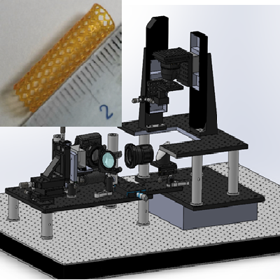
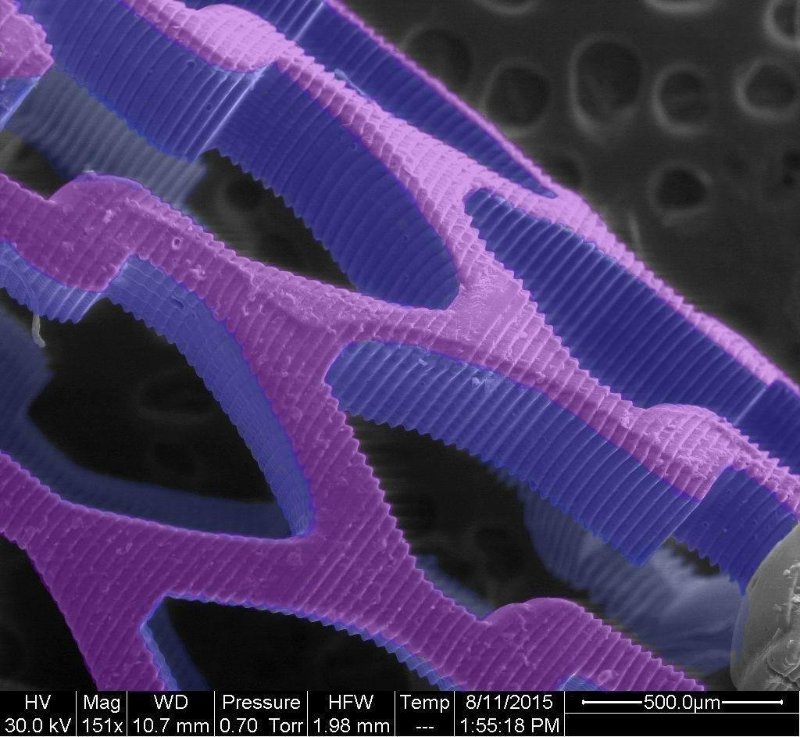
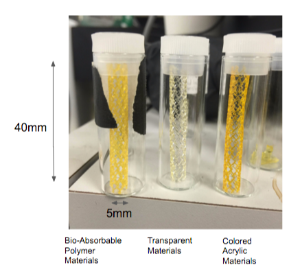
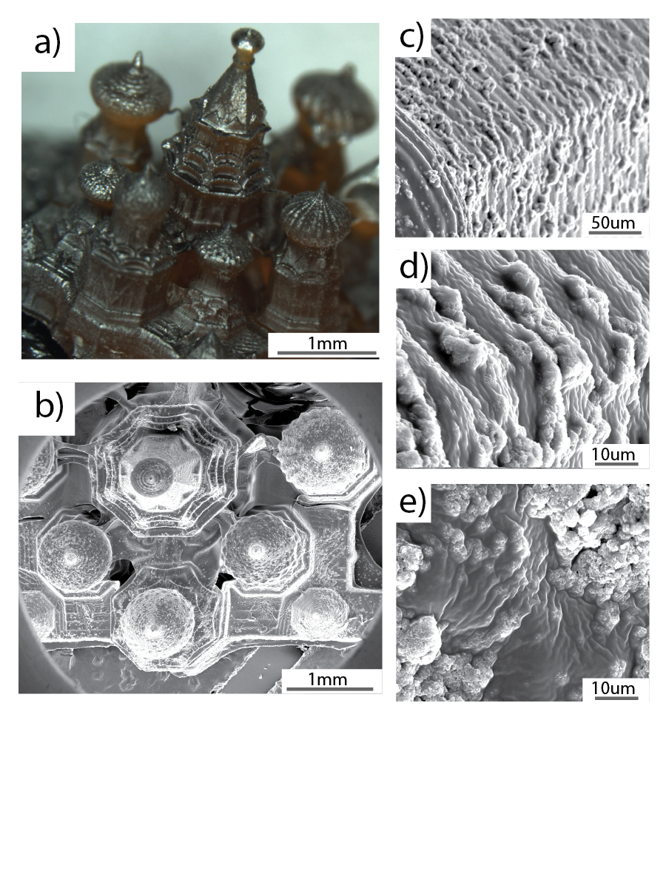
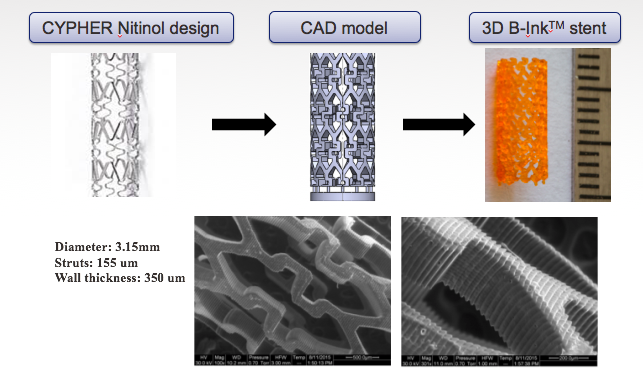
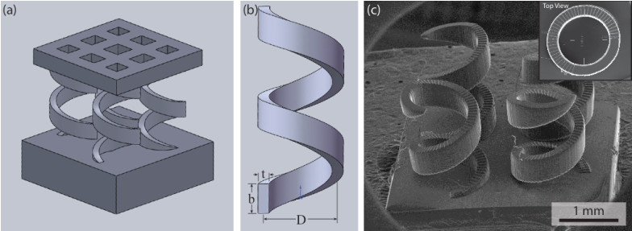
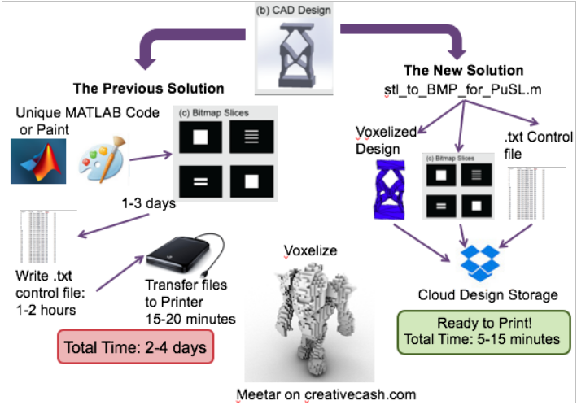
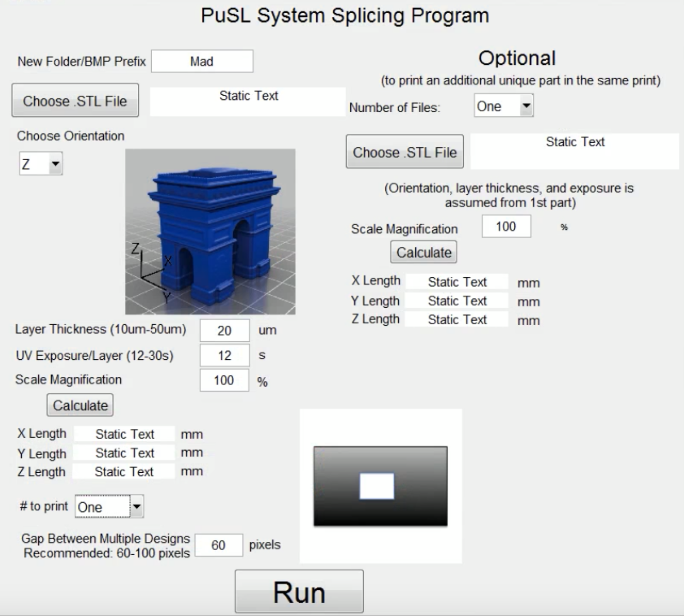
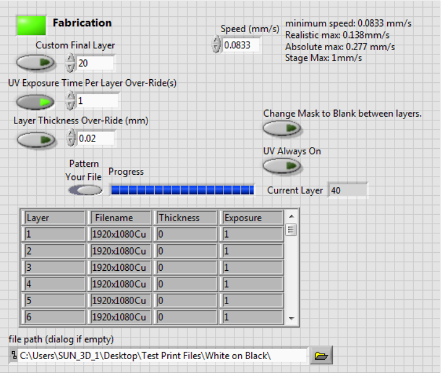
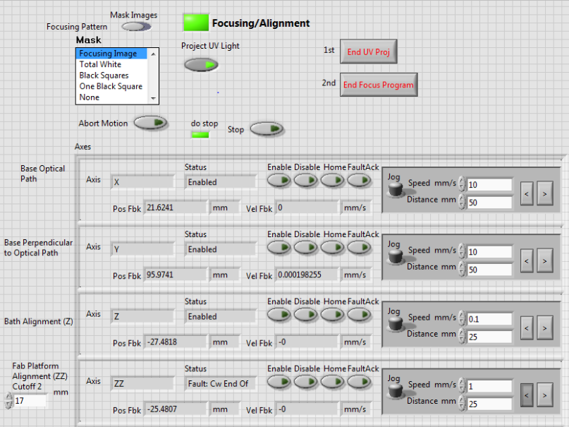

# Stereolithography_CLIP_3D_Printing
Code to convert .stl files to bitmaps for custom stereolithography and CLIP printers

During my PhD at Northwestern, I designed, and wrote software to control, Stereolithography and CLIP based 3D printers.  In the long term, this repository will include both a little information about the 3D printers that I built as well as the code to convert any .stl file into information that these printers can use and the LabVIEW code that was used to run the printers.

# Designing the 3D Printer

The 3D printer was designed using SolidWorks 3D modeling software.  

# Printed Objects

3D-printed degradable antioxidant stent - Scanning Electron Microscopy Image
NUANCE Scientific Images Contest 2015 - Honorable Mention False-colored SEM image of a 3D printed stent. The stent is made from a citric acid-based material that is biodegradable, antioxidant and curable via UV light.

# Convert .stl to .bmp for stereolithography

The purpose of this script was to massivly reduce the amount of time required to go from a new design, to starting the print process.

The specific matlab script to perform this work is STL_to_BMP_for_PuSL.m

I built a user-interface so that it would be simple for any new user to take their design and convert that design into a format that the 3D printer would understand.

After running this graphical user interface, the file you selected had it's format converted to the appropriate format for the 3D printer and the file was moved from whatever local computer you were working on to our Dropbox cloud storage system. 

The printer could then directly access any files stored in the cloud storage system.

# 3D Printer Software

The software for the 3D printer was written using a combination of Labview and C++ and APIs provided by Vialux (Dynamic Mask) and Nikon (camera imaging solution).

Multiple interfaces were created, one with a lot of technical details for easy engineering / refinement, and a second 'fabrication' pane with less options for the more general user. 

The alignment interface was more complex, and influenced heavily by alignment tools imported into LabVIEW directly from the mechanical stage company.

